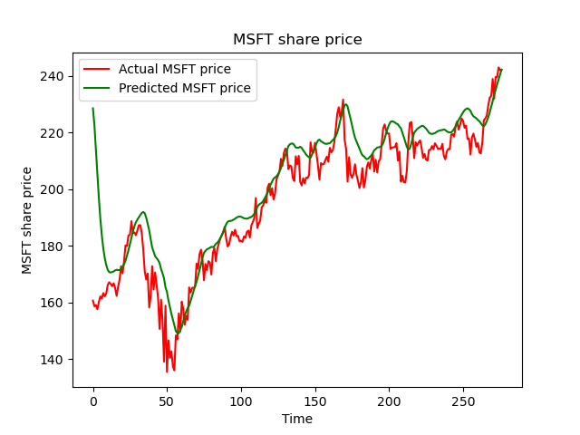
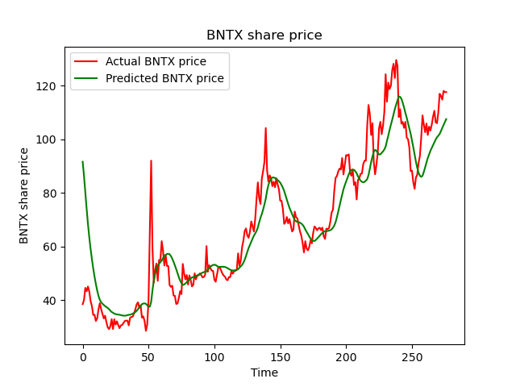

<p align="center">
  <a href="https://example.com/">
    
  </a>

  <h3 align="center">AI Stock prediction</h3>

  <p align="center">
    A simple python application that tries to predict the closing price of a stock for the next day.
    <br>
   
  </p>
</p>


## Table of contents

- [Disclaimer](#disclaimer)
- [Charts](#charts)
- [How to run](#how-to-run)
- [Libaries](#libaries)
- [Copyright and license](#copyright-and-license)


## Disclaimer
<span style="color:red">ATTENTION: THIS APPLICATION IS NOT INTENDED TO BE A INVESTMENT ADVICE, THIS PROJECT ONLY SERVES TO ILLUSTRATE APPROACHES FROM PROGRAMMING IN ORDER TO BETTER UNDERSTAND AI.</span>


## Charts




## How to run

These arguments indicate the basis on which the AI can be trained.

```python
company = 'MSFT'
start_time = dt.datetime(2010,1,1)
end_time = dt.datetime(2020,12,31)
data = pdr.DataReader(company, 'yahoo', start_time, end_time)
```
This is where the model for the AI is created. The epochs and the batch_size can be different from stock to stock. Try out different values to achieve a "better result".
```python
model = Sequential()
model.add(LSTM(units=50,return_sequences=True))
model.add(Dropout(0.2))
model.add(LSTM(units=50))
model.add(Dropout(0.2))
model.add(Dense(units=1))

model.compile(optimizer='adam',loss='mean_squared_error')
model.fit(x_train,y_train, epochs=25, batch_size=32)
```
After training the AI tries to predict the closing value for the upcoming day.
```python
real_data = [model_inputs[len(model_inputs)+1 -pred_days:len(model_inputs+1),0]]
real_data = np.array(real_data)
real_data = np.reshape(real_data, (real_data.shape[0],real_data.shape[1],1))
prediction = model.predict(real_data)
prediction = scaler.inverse_transform(prediction)
print(f"Prediction for the next day:{prediction}")
```
The pre-trained model can be saved to save time when using it later.
```python
model.save('microsoft_model')
new_model =load_model('microsoft_model')
```

## Libaries
* numpy
* matplotlib
* pandas
* pandas_datareader
* sklearn
* tensorflow


## Copyright and license

Code and documentation copyright 2021 MrTob. Code released under the [MIT License](LICENSE).

Enjoy :metal: